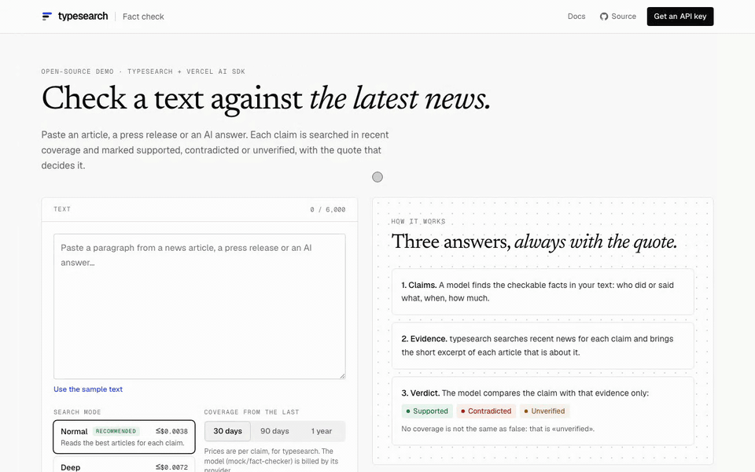
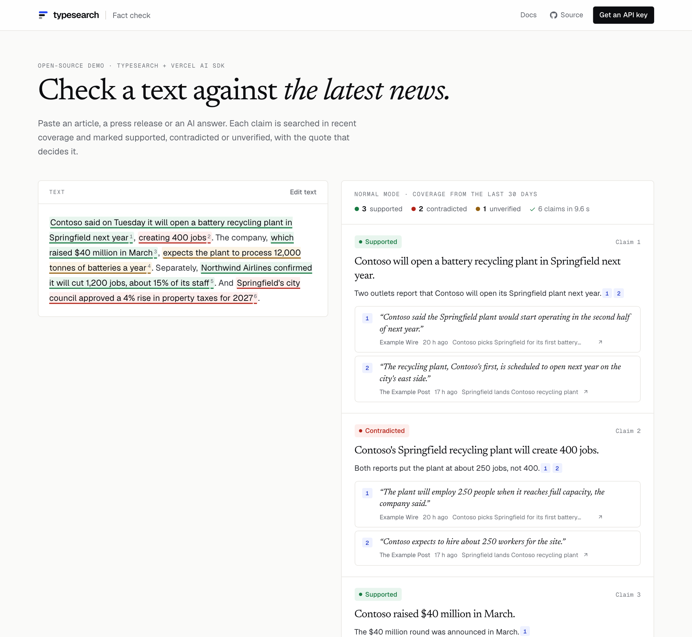

# Fact check

**Paste a text and check every claim against the latest news.** Each checkable claim is searched in
recent coverage and marked **supported**, **contradicted** or **unverified**, with the quote that
decides it and a link to the article. An open-source demo of [typesearch](https://typesearch.ai), the
news search API for AI agents, and the [Vercel AI SDK](https://ai-sdk.dev).

[](https://vercel.com/new/clone?repository-url=https%3A%2F%2Fgithub.com%2Ftypesearch%2Ffact-check&env=TYPESEARCH_API_KEY&envDescription=Your%20typesearch%20API%20key.%20The%20model%20runs%20on%20the%20Vercel%20AI%20Gateway%20with%20no%20extra%20key.&envLink=https%3A%2F%2Fapp.typesearch.ai&project-name=fact-check&repository-name=fact-check)



<sub>The recording uses the demo's sample mode: fictional outlets on `.example` domains, made-up companies and a made-up city.</sub>

## What it does

1. **Claims.** The model reads your text and lists the facts that recent news can confirm or refute —
   who did or said what, when, how much — each rewritten to stand on its own, with a short search query.
   Opinions and generic statements are left out.
2. **Evidence.** For each claim, typesearch searches recent coverage and then asks for the excerpt of
   each article that is about that exact claim:

   ```ts
   const found = await ts.search(claim.query, { mode: 'normal', days: 30, max_results: 8, highlights: true });
   const top = found.results.filter((r) => r.score >= 0.5).slice(0, 4);
   const pages = await ts.contents(top.map((r) => r.url), { query: claim.claim });
   // pages.results[i].excerpt: a short verbatim quote (up to 25 words) about the claim
   // pages.results[i].relevance: the probability that the article is about it
   ```

3. **Verdict.** The model compares the claim with that evidence only. *Supported* needs every key part
   (names, numbers, dates) to match; *contradicted* needs the evidence to say something incompatible;
   anything else is *unverified*. **Missing coverage is never «false».**
4. **Nothing without a quote.** A verdict of supported or contradicted must cite real evidence; if it
   does not, it becomes unverified. Claims with no relevant coverage are unverified without asking the
   model.
5. **You see what it cost**: every search and excerpt (from each response's `usage.cost_usd`) and the
   model calls.



## Run it

You need Node 22.18 or newer, a [typesearch API key](https://app.typesearch.ai) and access to a model.

```bash
git clone https://github.com/typesearch-ai/fact-check
cd fact-check
npm install
cp .env.example .env.local   # then fill it in
npm run dev
```

Open http://localhost:3000. To try the interface without any key, run `DEMO_MOCK=1 npm run dev` and
use the sample text: the API and the model answer with fictional data.

### Environment

| Variable | | |
| --- | --- | --- |
| `TYPESEARCH_API_KEY` | required | From [app.typesearch.ai](https://app.typesearch.ai). |
| `MODEL` | optional | A `provider/model` id. Defaults to `openai/gpt-6-luna`; a larger model judges harder texts better. |
| `AI_GATEWAY_API_KEY` | locally | The [Vercel AI Gateway](https://vercel.com/ai-gateway) runs any `MODEL`. Not needed on Vercel: the project's OIDC token is used. |
| `OPENAI_API_KEY` · `ANTHROPIC_API_KEY` | optional | Call that provider directly instead, with a matching `MODEL` (`openai/…`, `anthropic/…`). |
| `TYPESEARCH_BASE_URL` | optional | Another API address, for testing. |
| `DEMO_MOCK` | optional | `1` for the fictional sample data. Ignored in Vercel production. |

## What a check costs

Per claim: one typesearch search in the mode you pick and the excerpts of up to four articles, plus one
short model call; and one model call for the whole text to find the claims. The form shows the most a
claim can cost on typesearch, from the API's own price list (`GET /v1/usage`), and each check shows
what it actually cost. Prices: [typesearch.ai/pricing](https://typesearch.ai/pricing).

`normal` is the recommended mode: it reads the best articles for each claim. `deep` also searches the
claim in other words, reads more, and searches the sites beyond the index when coverage is thin.

## Limits

- It checks against **news coverage**, not against every source in the world: a true claim nobody
  reported comes out unverified.
- The evidence is short by design: a headline, a standfirst and quotes of up to 25 words per article.
  typesearch never returns full articles.
- The verdict is a language model's reading of that evidence. The quotes and links are there so you
  can check it.

## Before you share a deployment

The keys stay on the server, but anyone who can open the page can spend your credit. Set a monthly
spend limit for the key in the [dashboard](https://app.typesearch.ai), and turn on
[Vercel Deployment Protection](https://vercel.com/docs/deployment-protection) if the demo is only for
you or your team.

## How it's built

| File | |
| --- | --- |
| [`lib/check.ts`](lib/check.ts) | Schemas and prompts for claims and verdicts, where each quote is in the text, the evidence, and the verdict check. |
| [`lib/run.ts`](lib/run.ts) | One check: claims, then evidence and verdict for four claims at a time. Every step is an event. |
| [`app/api/check/route.ts`](app/api/check/route.ts) | Streams those events to the page as NDJSON. |
| [`lib/citations.ts`](lib/citations.ts) | Parses `[n]` citations and drops the ones that point nowhere. |
| [`lib/model.ts`](lib/model.ts) | The model: AI Gateway, or OpenAI / Anthropic with their own keys. |
| [`components/Checker.tsx`](components/Checker.tsx) | The text, the highlights and the claims. |

It uses the [typesearch-js](https://www.npmjs.com/package/typesearch-js) SDK; the same calls are
`POST /v1/search` and `POST /v1/contents` from any language, or the `search_news` and `get_contents`
tools of the [typesearch MCP server](https://typesearch.ai/docs).

```bash
npm run lint && npm run typecheck && npm test   # tests validate every request against the API's OpenAPI document
```

## License

[MIT](LICENSE)
